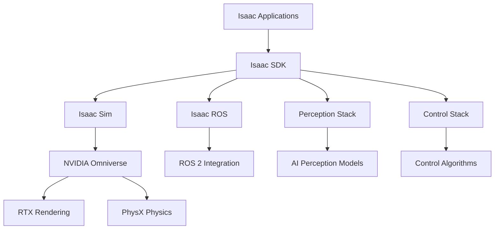

# Chapter 9: NVIDIA Isaac SDK & Isaac Sim Overview

## Chapter Overview

This chapter provides a comprehensive introduction to the NVIDIA Isaac SDK and Isaac Sim - powerful tools for developing, simulating, and deploying AI-powered robotic applications. The Isaac ecosystem offers state-of-the-art simulation capabilities, perception algorithms, and control frameworks specifically designed for advanced robotics applications including humanoid robots and embodied AI systems.

The NVIDIA Isaac platform combines high-fidelity physics simulation, realistic sensor modeling, and GPU-accelerated AI processing to create an end-to-end development environment for next-generation robotic systems. Understanding the Isaac SDK and Isaac Sim is essential for developing sophisticated Physical AI applications that require realistic simulation and efficient deployment to real hardware.

## Learning Outcomes

By the end of this chapter, you will be able to:
- Understand the architecture and components of the NVIDIA Isaac SDK
- Configure and utilize Isaac Sim for high-fidelity robotic simulation
- Implement perception and control pipelines using Isaac tools
- Integrate Isaac Sim with ROS 2 and other robotics frameworks
- Deploy Isaac-based applications to NVIDIA hardware platforms
- Leverage Isaac's AI capabilities for robotic perception and planning

## Introduction to NVIDIA Isaac Ecosystem

The NVIDIA Isaac ecosystem represents a comprehensive platform for developing AI-powered robots, combining simulation, perception, planning, and control capabilities in a unified framework. At its core, the Isaac platform leverages NVIDIA's GPU computing capabilities to accelerate robotics development and deployment.

### Key Components

The Isaac ecosystem consists of several key components:

1. **Isaac Sim**: A high-fidelity simulation environment built on NVIDIA Omniverse, providing photorealistic rendering and accurate physics simulation
2. **Isaac SDK**: A collection of libraries, tools, and frameworks for robotics development
3. **Isaac ROS**: ROS 2 packages that integrate Isaac capabilities with the Robot Operating System
4. **Isaac Apps**: Pre-built applications for common robotics tasks
5. **Deep Learning Models**: Pre-trained models for perception tasks optimized for NVIDIA hardware

### Architecture Overview



The architecture provides a modular approach to robotics development, allowing developers to leverage specific components based on their application requirements while maintaining interoperability across the entire ecosystem.

## Isaac SDK Fundamentals

The Isaac SDK provides the foundational building blocks for developing robotic applications. It includes a comprehensive set of libraries for perception, planning, control, and simulation.

### Core Libraries

The Isaac SDK includes several core libraries:

- **Isaac Core**: Basic utilities and data structures for robotics applications
- **Isaac Perception**: Computer vision and sensor processing algorithms
- **Isaac Planning**: Motion planning and navigation algorithms
- **Isaac Control**: Control theory implementations and robot controllers
- **Isaac Apps**: Pre-built applications and reference implementations

### Development Environment

Setting up the Isaac SDK requires NVIDIA GPU hardware and appropriate drivers:

```bash
# Install Isaac SDK prerequisites
sudo apt-get update
sudo apt-get install nvidia-driver-470
sudo apt-get install cuda-toolkit-11-8
sudo apt-get install nvidia-isaac-sdk

# Verify installation
nvidia-smi
nvcc --version
```

### Basic Application Structure

```cpp
// Example Isaac SDK application
#include "engine/alice/alice.hpp"
#include "messages/messages.hpp"

namespace nvidia {
namespace isaac {
namespace samples {

// A simple Isaac application component
class HelloWorld : public alice::Codelet {
 public:
  void start() override {
    LOG_INFO("Hello from Isaac SDK!");
    tickPeriodically();
  }

  void tick() override {
    // Application logic here
    LOG_INFO("Isaac SDK is running...");
  }
};

}  // namespace samples
}  // namespace isaac
}  // namespace nvidia

// Register the component
ISAAC_ALICE_REGISTER_CODELET(nvidia::isaac::samples::HelloWorld);
```

## Integration with Physical AI Systems

The Isaac platform provides excellent support for Physical AI and humanoid robotics applications through its simulation capabilities, perception algorithms, and control frameworks. The platform's emphasis on realistic simulation makes it particularly valuable for developing embodied AI systems that must interact with the physical world.

## Looking Forward

This chapter establishes the foundation for understanding the NVIDIA Isaac ecosystem, which will be essential when implementing perception, planning, and control systems for Physical AI applications. The simulation capabilities provided by Isaac Sim enable extensive testing and validation before deployment to real hardware, making it a critical tool in the robotics development pipeline.
