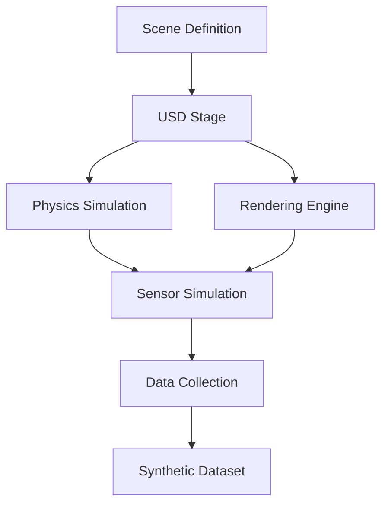

# Isaac Sim: High-Fidelity Simulation for Physical AI

## Introduction to Isaac Sim

Isaac Sim is NVIDIA's high-fidelity simulation environment built on the Omniverse platform, specifically designed for robotics development and testing. It provides photorealistic rendering, accurate physics simulation, and comprehensive sensor modeling capabilities that enable developers to create realistic virtual environments for training and testing AI-powered robots.

Isaac Sim bridges the gap between simulation and reality by providing domain randomization, synthetic data generation, and sim-to-real transfer capabilities that are essential for Physical AI applications. The platform leverages NVIDIA's RTX rendering technology and PhysX physics engine to create immersive and physically accurate simulation environments.

## Core Features and Capabilities

### Photorealistic Rendering

Isaac Sim provides state-of-the-art rendering capabilities that enable realistic visual simulation:

- **RTX Ray Tracing**: Real-time ray tracing for accurate lighting and shadows
- **Material System**: Physically-based materials with realistic reflectance properties
- **Lighting Models**: Advanced lighting with global illumination and realistic shadows
- **Environmental Effects**: Weather simulation, atmospheric effects, and dynamic lighting

```python
# Example: Creating a realistic environment in Isaac Sim
import omni
from pxr import Gf, UsdGeom, Sdf
import carb

# Initialize Isaac Sim
from omni.isaac.kit import SimulationApp
simulation_app = SimulationApp({"headless": False})

# Import required modules
from omni.isaac.core import World
from omni.isaac.core.utils.stage import add_reference_to_stage
from omni.isaac.core.utils.prims import create_prim
from omni.isaac.core.utils.semantics import add_update_semantics

# Create a realistic environment
world = World(stage_units_in_meters=1.0)

# Add realistic ground plane with material
ground_plane = create_prim(
    prim_path="/World/ground_plane",
    prim_type="Plane",
    position=[0, 0, 0],
    scale=[10, 10, 1]
)

# Apply realistic material
from omni.isaac.core.materials import OmniPBR
ground_material = OmniPBR(
    prim_path="/World/Looks/ground_material",
    diffuse_color=(0.2, 0.4, 0.1),
    roughness=0.7,
    metallic=0.0
)

# Add lighting
dome_light = create_prim(
    prim_path="/World/DomeLight",
    prim_type="DomeLight",
    position=[0, 0, 0]
)

simulation_app.close()
```

### Physics Simulation

The physics engine in Isaac Sim provides accurate simulation of physical interactions:

- **PhysX Integration**: NVIDIA PhysX for realistic physics simulation
- **Rigid Body Dynamics**: Accurate simulation of rigid body interactions
- **Soft Body Simulation**: Deformable object simulation for complex environments
- **Fluid Dynamics**: Water and fluid simulation for complex scenarios
- **Contact Materials**: Realistic friction and contact properties

```python
# Example: Configuring physics properties for a robot
import omni
from omni.isaac.core import World
from omni.isaac.core.utils.prims import get_prim_at_path
from pxr import UsdPhysics, PhysxSchema

def configure_robot_physics(robot_prim_path):
    """Configure physics properties for a robot in Isaac Sim"""

    # Get the robot prim
    robot_prim = get_prim_at_path(robot_prim_path)

    # Set up rigid body properties
    rigid_body_api = UsdPhysics.RigidBodyAPI.Apply(robot_prim)
    rigid_body_api.CreateVelocityThresholdAttr().Set(0.1)
    rigid_body_api.CreateMaxDepenetrationVelocityAttr().Set(10.0)

    # Configure mass properties
    mass_api = UsdPhysics.MassAPI.Apply(robot_prim)
    mass_api.CreateMassAttr().Set(10.0)  # 10 kg

    # Set up collision properties
    collision_api = UsdPhysics.CollisionAPI.Apply(robot_prim)
    collision_api.CreateContactOffsetAttr().Set(0.001)
    collision_api.CreateRestOffsetAttr().Set(0.0)

# Example usage
world = World(stage_units_in_meters=1.0)
configure_robot_physics("/World/MyRobot/base_link")
```

### Sensor Simulation

Isaac Sim provides comprehensive sensor simulation with realistic noise models:

#### Camera Sensors
- **RGB Cameras**: High-resolution color cameras with adjustable parameters
- **Depth Cameras**: Accurate depth estimation with realistic noise
- **Stereo Cameras**: Binocular vision with disparity computation
- **Fish-eye Cameras**: Wide-angle vision simulation

#### LIDAR Sensors
- **3D LIDAR**: Multi-layer LIDAR simulation with configurable parameters
- **2D LIDAR**: Planar LIDAR for navigation applications
- **Semantic LIDAR**: LIDAR with semantic segmentation capabilities

#### IMU and Inertial Sensors
- **Accelerometer**: Realistic acceleration measurements with noise
- **Gyroscope**: Angular velocity measurements with drift characteristics
- **Magnetometer**: Magnetic field sensing for orientation

```python
# Example: Adding sensors to a robot in Isaac Sim
from omni.isaac.sensor import Camera, RayCaster
from omni.isaac.core.utils.prims import get_prim_at_path
import numpy as np

def add_sensors_to_robot(robot_prim_path):
    """Add various sensors to a robot in Isaac Sim"""

    # Add RGB camera
    camera = Camera(
        prim_path=f"{robot_prim_path}/camera",
        position=np.array([0.1, 0, 0.1]),
        orientation=np.array([0, 0, 0, 1]),
        frequency=30,
        resolution=(640, 480)
    )

    # Configure camera properties
    camera.set_focal_length(24.0)
    camera.set_horizontal_aperture(20.955)
    camera.set_vertical_aperture(15.29)

    # Add depth sensor
    depth_camera = Camera(
        prim_path=f"{robot_prim_path}/depth_camera",
        position=np.array([0.1, 0, 0.1]),
        orientation=np.array([0, 0, 0, 1]),
        frequency=30,
        resolution=(640, 480)
    )

    # Enable depth data
    depth_camera.add_distance_to_image_prim()

    # Add LIDAR sensor
    lidar = RayCaster(
        prim_path=f"{robot_prim_path}/lidar",
        positions=np.array([[0.0, 0.0, 0.2]]),
        directions=np.array([[1.0, 0.0, 0.0]]),
        max_dist=10.0
    )

    return camera, depth_camera, lidar

# Example usage
camera, depth_camera, lidar = add_sensors_to_robot("/World/MyRobot")
```

## Domain Randomization and Synthetic Data Generation

### Domain Randomization

Domain randomization is a key feature of Isaac Sim that helps bridge the sim-to-real gap:

- **Material Randomization**: Randomizing surface properties and appearances
- **Lighting Randomization**: Varying lighting conditions and shadows
- **Object Placement**: Randomizing object positions and configurations
- **Camera Parameters**: Varying camera settings and viewpoints

```python
# Example: Implementing domain randomization
import random
from omni.isaac.core.utils.prims import get_prim_at_path
from omni.isaac.core.materials import OmniPBR

def randomize_environment():
    """Apply domain randomization to the environment"""

    # Randomize ground material
    colors = [
        (0.2, 0.4, 0.1),  # Green
        (0.4, 0.4, 0.4),  # Gray
        (0.6, 0.3, 0.1),  # Brown
        (0.8, 0.8, 0.8),  # Light gray
    ]

    selected_color = random.choice(colors)

    ground_material = OmniPBR(
        prim_path="/World/Looks/randomized_ground",
        diffuse_color=selected_color,
        roughness=random.uniform(0.3, 0.9),
        metallic=random.uniform(0.0, 0.2)
    )

    # Randomize lighting
    dome_light = get_prim_at_path("/World/DomeLight")
    dome_light.GetAttribute("inputs:color").Set(
        (random.uniform(0.8, 1.0), random.uniform(0.8, 1.0), random.uniform(0.8, 1.0))
    )

    # Randomize object positions
    for i in range(5):
        obj_path = f"/World/RandomObject_{i}"
        if get_prim_at_path(obj_path):
            x = random.uniform(-3, 3)
            y = random.uniform(-3, 3)
            get_prim_at_path(obj_path).GetAttribute("xformOp:translate").Set((x, y, 0))

# Example usage
randomize_environment()
```

### Synthetic Data Generation

Isaac Sim excels at generating large-scale synthetic datasets:

- **Semantic Segmentation**: Pixel-perfect semantic labels
- **Instance Segmentation**: Individual object instance labels
- **Depth Maps**: Accurate depth information
- **Optical Flow**: Motion vectors for dynamic scenes
- **Bounding Boxes**: 2D and 3D bounding box annotations

## Isaac Sim Architecture

### Omniverse Integration

Isaac Sim is built on NVIDIA's Omniverse platform, providing:

- **USD Scene Description**: Universal Scene Description for 3D scenes
- **Real-time Collaboration**: Multi-user editing capabilities
- **Extensible Framework**: Custom extensions and tools
- **Cross-platform Support**: Consistent experience across platforms

### Simulation Pipeline

The Isaac Sim pipeline includes several key components:

1. **Scene Generation**: Creating and managing 3D environments
2. **Physics Simulation**: Computing physical interactions
3. **Rendering**: Generating visual output
4. **Sensor Simulation**: Computing sensor data
5. **Data Export**: Saving simulation data for training



## Integration with AI and Deep Learning

### Training AI Models

Isaac Sim provides tools for training AI models in simulation:

- **Reinforcement Learning**: Training agents in virtual environments
- **Imitation Learning**: Learning from expert demonstrations
- **Self-Supervised Learning**: Learning from raw sensor data
- **Transfer Learning**: Adapting models from simulation to reality

### Perception Training

The platform is ideal for training perception models:

```python
# Example: Collecting training data for object detection
import omni
from omni.isaac.core import World
from omni.isaac.core.utils.viewports import set_active_viewport_camera
import numpy as np
import cv2
import json

def collect_training_data(num_samples=1000):
    """Collect synthetic training data for perception models"""

    world = World(stage_units_in_meters=1.0)
    camera = Camera(
        prim_path="/World/TrainingCamera",
        position=np.array([2.0, 0.0, 1.5]),
        orientation=np.array([0.707, 0, -0.707, 0])  # Looking down at 45 degrees
    )

    training_data = []

    for i in range(num_samples):
        # Randomize scene
        randomize_environment()

        # Capture RGB image
        rgb_image = camera.get_rgb()

        # Capture semantic segmentation
        semantic_image = camera.get_semantic_segmentation()

        # Capture depth
        depth_image = camera.get_depth()

        # Save images
        cv2.imwrite(f"training_data/rgb_{i:04d}.png", cv2.cvtColor(rgb_image, cv2.COLOR_RGB2BGR))
        cv2.imwrite(f"training_data/semantic_{i:04d}.png", semantic_image)
        np.save(f"training_data/depth_{i:04d}.npy", depth_image)

        # Create annotation
        annotation = {
            "image_id": i,
            "rgb_path": f"rgb_{i:04d}.png",
            "semantic_path": f"semantic_{i:04d}.png",
            "depth_path": f"depth_{i:04d}.npy",
            "objects": []  # Populate with object information
        }

        training_data.append(annotation)

        # Save annotations periodically
        if i % 100 == 0:
            with open(f"training_data/annotations_{i:04d}.json", 'w') as f:
                json.dump(training_data, f)

    # Save final annotations
    with open("training_data/final_annotations.json", 'w') as f:
        json.dump(training_data, f)

# Example usage
collect_training_data(num_samples=1000)
```

## Best Practices for Isaac Sim

### 1. Environment Design
- Create diverse and realistic environments
- Include various lighting conditions
- Add domain randomization for robust training
- Validate environments against real-world scenarios

### 2. Performance Optimization
- Use appropriate level of detail for objects
- Optimize scene complexity for target frame rates
- Use occlusion culling for large environments
- Configure physics parameters for optimal performance

### 3. Data Quality Assurance
- Validate synthetic data against real-world data
- Check for artifacts and inconsistencies
- Ensure proper calibration of virtual sensors
- Monitor simulation accuracy over time

## Real-world Applications

Isaac Sim has been successfully applied to various robotics domains:

- **Warehouse Automation**: Training robots for picking and sorting tasks
- **Autonomous Driving**: Simulating complex traffic scenarios
- **Manufacturing**: Programming robotic assembly and inspection
- **Service Robotics**: Training robots for human interaction
- **Research**: Developing new algorithms and testing hypotheses

Isaac Sim provides the high-fidelity simulation environment necessary for developing robust Physical AI systems. Its combination of realistic rendering, accurate physics, and comprehensive sensor modeling makes it an invaluable tool for bridging the gap between simulation and real-world deployment.
